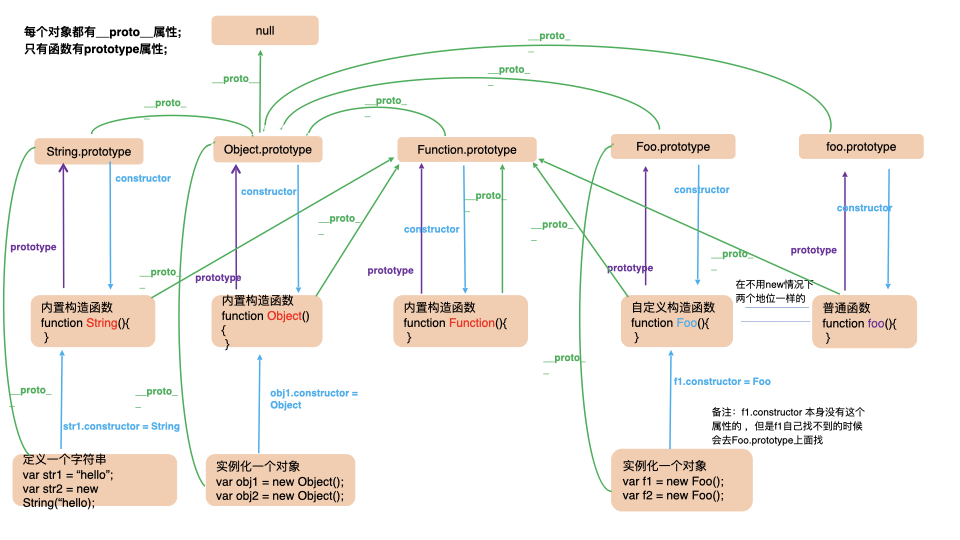

### 1.什么叫 JavaScript 的原型

#### 答:JavaScript 的原型其实就是一个对象的属性,只不过这个属性很特殊，对于外界一般来说不可见的 chrome 中可以通过`__proto__`获取

### 2.那么什么是原型链

#### 答:就是某一对象的原型属性保存或者等于另一个对象 由此类推就形成了原型链 链的终点是 Object.prototype 对象，因此 Object.prototype 没有原型，但我们构建一个对象这个对象的默认原型就是 Object.prototype

```
   obj1.__proto__= obj2; obj2.__proto__ = obj3; .....==>Object.prototype ==>null;a.__proto__ = b;
   // 其实就实现了一个继承了
   var a = {};console.log(Object.prototype ===a.__proto__);
```

### 函数中的原型概念

1. 每个对象都有个隐式原型也就是`__proto__`属性,当然这其中也包含函数也有`__proto__`属性。

2. 只有函数有 prototype 属性,所有函数的 prototype 原型对象的`__proto__`默认指向 Object.prototype

3. 所有函数的`__proto__`默认指向 Function.prototype;

4. 所有对象的`__proto__`默认指向 Object.prototype;

5. 由构造函数创建的新对象的`__proto__`指向该构造函数的 prototype;

### 详细介绍

1. 每个对象都有个隐式原型也就是`__proto__`属性,当然这其中也包含函数也有`__proto__`属性。

```
   var str = "str";
   console.log(str.__proto__ )
   var num = 123;
   console.log(num.__proto__ )
   var fn = function(){

   };
   console.log(fn.__proto__ )

```

2. 只有函数有 prototype 属性,所有函数的 prototype 原型对象的`__proto__`默认指向 Object.prototype

```
    var person= function(){

    }
    person.prototype.__proto__ === Object.prototype;

```

3. 所有函数的`__proto__`默认指向 Function.prototype;

```
   var person= function(){

   }
   person.__proto__ === Function.prototype;
   //js的内置构造函数 Object String Number Boolean ...
   Object.__proto__ === Function.prototype;
   String.__proto__ === Function.prototype;

```

4. 所有对象的`__proto__`默认指向 Object.prototype;

```
   var obj ={};

```

5. 由构造函数创建的新对象的`__proto__`指向该构造函数的 prototype;

```
   function Person(){

   }
   var person = new Person();
   person.__proto__ === Person.prototype;

```



### 函数通过 new 调用执行的时候实际干了下面几件事情

1. 在内存中创建了一个新对象；
2. 将这个新对象的 `[[prototype]](__proto__)`连接到构造函数的prototype属性上
3. 将构造函数内的 this 绑定到这个新对象上
4. 执行内部代码（给新对象添加属性和方法）
5. 默认返回这个新对象（注意手动改写返回的对象）
